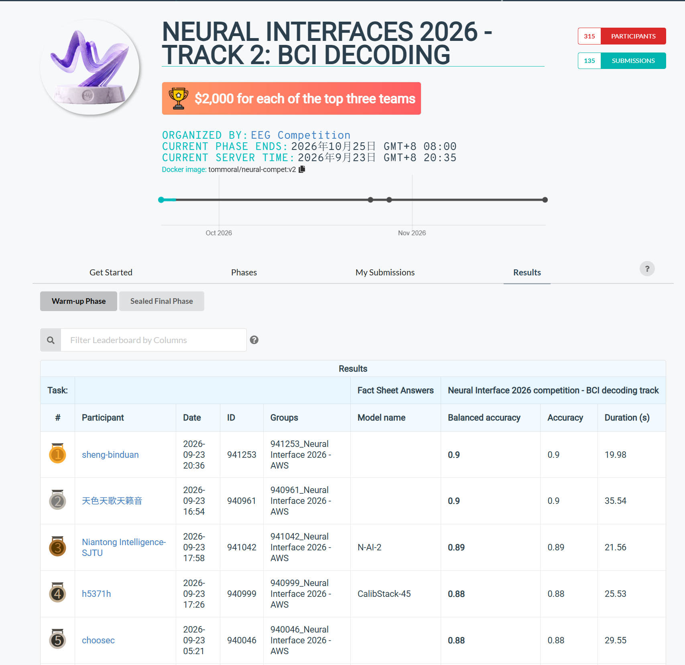

# 🧠 NeurIPS Competition 2026

This repository is created for our participation in the **NeurIPS Competition 2026**.

We are currently focusing on **Track 2: BCI Decoding**.  
The repository is used to share code, track experiments, and record our progress during the competition.

## 🏆 Warm-up Phase

Our current submission achieved a **Balanced Accuracy of 0.90** in the warm-up phase.

## 📌 Status

🚧 Experiments and model improvements are still in progress.
